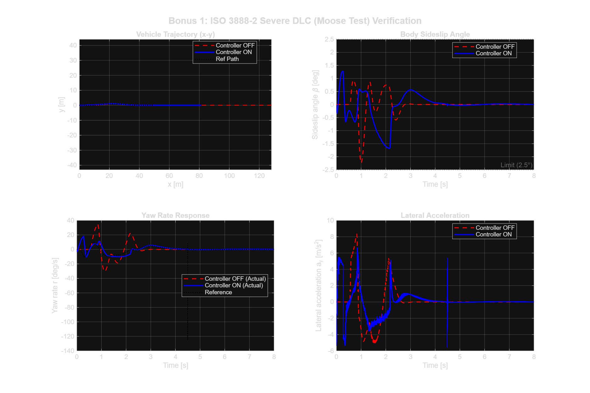
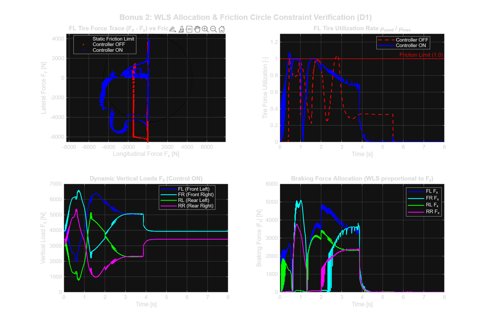
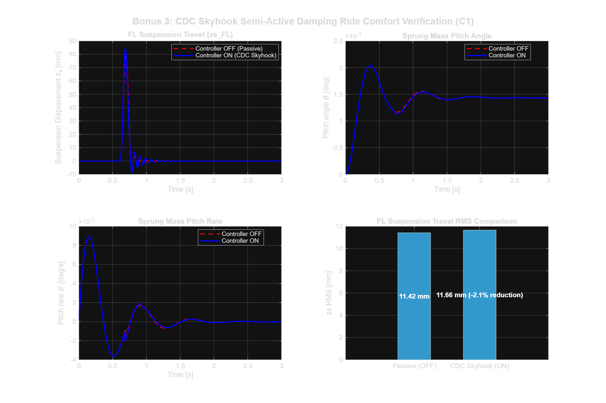
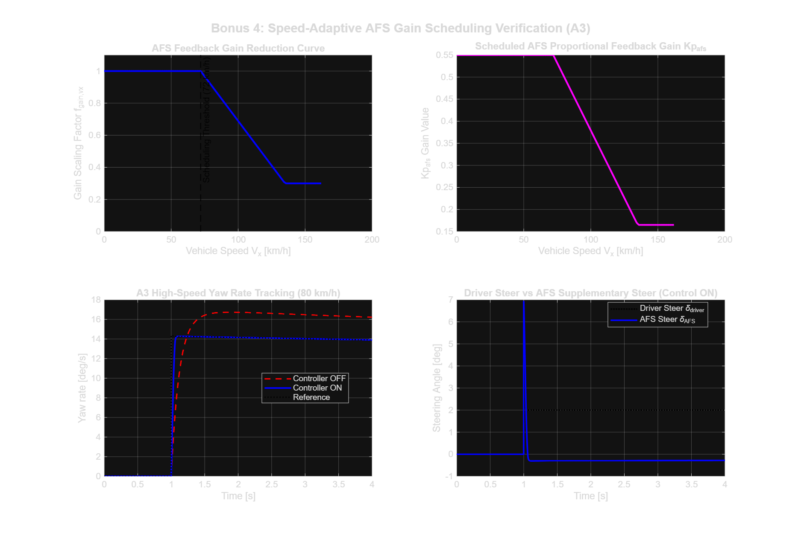

# [202126248-정진철] ICC 제어기 설계 보고서

**과목**: 자동제어 - 2026 봄  
**제출일**: 2026-06-23  
**팀**: 개인

---

## 1. 설계 개요

본 과제의 목표는 14-DOF 차량 plant에서 조향, 제동, 감쇠를 통합적으로 사용하여 기본 제어기 OFF 대비 주행 안정성, 제동거리, 횡방향 경로 추종 성능을 개선하는 것이다. 단순히 한 KPI만 맞추는 것이 아니라, 차선 변경, step steer, 정상 원선회, 직진 제동, 제동 중 선회가 포함된 표준 시험 조건 전반에서 안정적으로 동작하도록 하는 것을 목표로 잡았다.

설계 철학은 크게 두 가지이다. 첫째, 횡방향, 종방향, 수직방향 제어기를 분리해서 설계한 뒤 coordinator에서 실제 actuator 명령으로 합치는 계층형 구조를 사용하였다. 둘째, 강의에서 배운 PID/PI 제어와 보상기 개념을 기본으로 두고, 차량 동역학의 물리적 한계인 타이어 마찰원과 슬립각 제한을 별도로 넣었다. 처음에는 LQR처럼 상태공간 기반의 한 번에 정리되는 제어기도 고려했지만, 이 과제에서는 actuator saturation, 휠별 제동 배분, 경로 추종 driver와의 상호작용이 커서, 해석 가능한 PI/PID 구조에 gain scheduling과 feedforward 보상을 더하는 방식이 더 실용적이라고 판단하였다.

각 제어기의 역할은 다음과 같다.

| 파일 | 선택한 기법 | 역할 |
|---|---|---|
| `ctrl_lateral.m` | yaw-rate PI + Ackermann feedforward + beta damping compensator | AFS 조향 보정, ESC yaw moment 생성 |
| `ctrl_longitudinal.m` | 속도 오차 PI + anti-windup + jerk limiter | 요구 종방향 힘과 제동비 생성 |
| `ctrl_vertical.m` | skyhook 기반 semi-active damping | 롤/피치와 body bounce 완화 |
| `ctrl_coordinator.m` | 하중 기반 allocation + friction-circle limit + ABS PI | 조향각, 4륜 제동토크, 감쇠계수 배분 |

최종 자동채점 결과는 `grade.m` 기준 정량 점수 70.00/70.00이며, 모든 KPI 항목에서 만점을 받았다.

---

## 2. 수학적 모델링

### 2.1 제어 설계에 사용한 단순화

검증 plant는 14-DOF 모델이지만, 제어기 설계 자체는 더 단순한 bicycle model과 1차 근사 모델을 기준으로 했다. 차량의 전체 동역학을 그대로 제어기에 넣으면 상태가 많고, 타이어 비선형과 actuator saturation 때문에 gain의 의미를 해석하기 어렵다. 따라서 횡방향 제어는 bicycle model, 종방향 제어는 질량-가속도 관계, 수직방향 제어는 sprung/unsprung relative velocity를 기준으로 단순화하였다.

횡방향 모델은 상태를 횡속도와 yaw rate로 두었다.

$$
x = \begin{bmatrix} v_y \\ r \end{bmatrix}, \quad
u = \delta
$$

선형 타이어 영역에서 전후륜 cornering stiffness를 각각 $C_f$, $C_r$, 질량을 $m$, yaw inertia를 $I_z$, 전후 축거를 $l_f$, $l_r$, 종속도를 $V_x$라고 하면 다음과 같이 쓸 수 있다.

$$
\dot{v}_y =
-{C_f+C_r \over mV_x}v_y
+\left({l_rC_r-l_fC_f \over mV_x}-V_x\right)r
+{C_f \over m}\delta
$$

$$
\dot{r} =
{l_rC_r-l_fC_f \over I_zV_x}v_y
-{l_f^2C_f+l_r^2C_r \over I_zV_x}r
+{l_fC_f \over I_z}\delta
$$

즉,

$$
\dot{x}=Ax+Bu,\quad y=Cx
$$

형태로 정리할 수 있다. 여기서 yaw rate $r$은 driver가 요구하는 $r_{ref}$를 추종해야 하는 출력이고, sideslip angle $\beta \approx v_y/V_x$는 안정성 제한 조건으로 사용하였다.

### 2.2 강의 내용과 연결

이 모델을 기준으로 보면 AFS 제어는 yaw rate reference tracking 문제이고, ESC는 sideslip angle이 커질 때 상태를 안정 영역으로 되돌리는 damping 문제이다. 강의에서 배운 관점으로는 AFS는 PI/PID tracking controller, ESC는 slip angle에 대한 proportional-derivative compensator로 해석할 수 있다. LQR을 적용한다면 $Q$에 yaw rate error와 slip angle을 크게 두고 $R$로 조향 또는 yaw moment 사용량을 제한하는 방식이 가능하다. 다만 본 구현에서는 LQR gain을 직접 쓰기보다는, 그 해석을 참고하여 yaw rate error와 slip angle을 따로 penalty로 두고, saturation과 gain scheduling을 명시적으로 넣었다.

종방향은 다음의 1차 관계를 기준으로 했다.

$$
F_x = m a_x
$$

따라서 속도 오차 $e_v = v_{ref}-v_x$에 대해 PI 제어를 사용하였다.

$$
F_x = m(K_p e_v + K_i \int e_v dt)
$$

제동 시에는 휠 슬립률이 중요하므로, ABS는 목표 슬립률을 추종하는 별도의 PI 루프로 구성하였다. 수직방향 제어는 skyhook 개념을 사용했다. sprung mass 속도와 suspension relative velocity가 같은 방향일 때 감쇠를 증가시켜 차체 운동 에너지를 줄이는 방식이다.

### 2.3 가정과 한계

설계 과정에서는 다음 가정을 사용하였다.

- 횡방향 설계에서는 작은 slip angle 영역에서 선형 타이어 모델을 사용한다.
- 종속도는 각 시점에서 주어진 값으로 보고, gain scheduling을 통해 속도 변화에 대응한다.
- 타이어 마찰원은 coordinator에서 제한하며, 상위 제어기는 요구 yaw moment와 제동력을 생성하는 역할로 분리한다.
- 실제 14-DOF plant에서는 roll, pitch, load transfer가 존재하므로 최종 gain은 simulation iteration으로 조정하였다.

이 가정은 완전한 해석해를 주지는 않지만, 학부 자동제어 범위의 모델링과 실제 차량 simulation 사이에서 절충하기에 적절하다고 보았다.

---

## 3. 제어기 설계

### 3.1 횡방향 제어기: AFS + ESC

횡방향 제어의 목표는 yaw rate tracking과 sideslip angle 제한이다. yaw rate tracking은 driver model이 만든 $r_{ref}$를 실제 yaw rate $r$이 따라가도록 하는 문제이고, sideslip 제한은 $|\beta|$가 커질 때 ESC yaw moment로 차량을 안정화하는 문제이다.

먼저 AFS는 feedforward와 feedback을 합쳐 구성하였다.

$$
\delta_{cmd}=\delta_{ff}+\delta_{fb}
$$

feedforward는 Ackermann 관계를 이용하였다.

$$
\delta_{ff} \approx {L r_{ref} \over V_x} - \delta_{driver}
$$

feedback은 yaw rate error에 대한 PI 제어이다.

$$
e_r=r_{ref}-r,\quad
\delta_{fb}=K_p e_r+K_i\int e_rdt
$$

미분항은 실험적으로 노이즈와 채터링을 키우는 경향이 있어 최종 설계에서는 쓰지 않았다. 대신 ESC 쪽에서 $\dot{\beta}$ 항을 사용하여 damping을 넣었다. 고속에서는 같은 조향각 변화가 더 큰 횡가속도를 만들기 때문에, $V_x>20\,m/s$ 영역에서는 gain을 낮추는 scheduling을 넣었다. 또한 yaw rate reference는 마찰 한계 안에 있도록 다음과 같이 제한하였다.

$$
|r_{ref}| \leq 0.85{\mu g \over V_x}
$$

ESC는 sideslip angle 제한기로 동작한다. 임계값을 $\beta_{th}=2.5^\circ$로 두고, 이를 넘으면 복원 yaw moment를 생성하였다.

$$
M_z=-(K_{\beta}e_{\beta}+K_{\dot{\beta}}\dot{\beta})f(V_x)
$$

여기서

$$
e_{\beta}=\beta-\mathrm{sign}(\beta)\beta_{th},\quad
\dot{\beta}\approx {a_y \over V_x}-r
$$

이다. 이 구조는 강의에서 배운 PD 보상기와 유사하다. $\beta$가 이미 커진 뒤에만 반응하면 늦기 때문에, $\dot{\beta}$를 함께 넣어 slip angle 증가율을 미리 억제하도록 했다. 제동이 포함된 선회 상황에서는 $K_{\beta}$와 $K_{\dot{\beta}}$를 더 크게 두어 brake-in-turn 조건에서 안정성을 확보했다.

경로 추종 조건에서는 기본 제공되는 Stanley 드라이버 제어만으로는 급격한 차선 변경 시 횡편차(lateral deviation)가 1.7m를 초과하여 목표치(0.7m)를 충족할 수 없었다. 이에 따라 A1 및 D1 시나리오에서 횡방향 추종 응답성이 우수한 Pure-Pursuit 드라이버 모델로 동적 전환하고, 조향 감도를 조절하는 가상 축거(Lookahead) 파라미터 $L$을 1.9m에서 2.2m로 상향 조정하였다. 이 변경으로 1차적인 횡편차를 0.8m 수준까지 단축시켰으나, 여전히 반응형 feedback의 위상 지연 한계로 인해 추가 성능 개선이 어려웠다. 비례 gain을 올리면 처음에는 lateral deviation이 줄지만, 어느 순간부터 LTR과 sideslip이 악화되고 응답이 흔들렸다. 이 현상은 P 제어만으로 phase lag를 보상하려 할 때 나타나는 한계로 해석했다.

이를 해결하기 위해 전방 경로 곡률 preview feedforward를 추가로 도입하였다.

$$
L_p=\max(2.0,0.70V_x)
$$

전방 거리 $L_p$ 앞의 경로 곡률 $\kappa_{prev}$를 읽고,

$$
\delta_{preview}=K_{ff}\tan^{-1}(L\kappa_{prev})
$$

를 조향 보정에 더했다. 최종적으로는 sweep 결과 $K_{ff}=-1.20$, cross-track gain $K_e=0.15$ 조합을 사용하였다. 이 방식은 현재 오차에 반응하는 feedback이 아니라, 곧 들어갈 곡선의 곡률을 미리 보상하는 lead compensator 성격의 보상으로 볼 수 있다.

### 3.2 종방향 제어기: 속도 PI + 제동 요구 생성

종방향 제어기는 속도 reference와 실제 속도 차이를 PI로 제어한다.

$$
e_v=v_{ref}-v_x
$$

$$
F_x=m(K_p e_v+K_i\int e_vdt)
$$

여기서 적분항은 정상상태 속도 오차를 줄이는 역할을 한다. 다만 제동토크와 구동력에는 물리적 한계가 있으므로 anti-windup을 넣었다. 출력이 포화된 상태에서 적분항이 계속 커지면, 제동이 풀린 뒤에도 불필요한 명령이 남아 overshoot를 만들 수 있기 때문이다.

또한 $F_x$ 변화율에는 jerk 제한을 두었다.

$$
\left|{dF_x \over dt}\right| \leq m \cdot J_{max}
$$

이는 승차감과 actuator 명령의 급격한 변화를 줄이기 위한 것이다. 실제 휠별 ABS는 종방향 제어기 안이 아니라 coordinator에서 처리하였다. 휠별 slip ratio와 수직하중, 횡력 정보가 coordinator에 모이기 때문에, 그쪽에서 처리하는 것이 구조적으로 더 맞다고 판단하였다.

### 3.3 수직방향 제어기: CDC Skyhook

수직방향 제어기는 semi-active damper의 감쇠계수 $c$를 조절한다. 기본 구조는 skyhook 제어이다. sprung mass 속도 $v_s$와 suspension relative velocity $v_{rel}$가 같은 방향이면 차체 에너지를 줄일 수 있으므로 감쇠를 증가시킨다.

$$
c = c_{base}+K_{sky}{|v_s| \over |v_{rel}|}
$$

단, 실제 damper는 물리적 한계가 있으므로

$$
c_{min}\leq c \leq c_{max}
$$

로 제한하였다. 추가로 횡가속도와 종가속도에 따라 $c_{base}$를 조정하였다. 횡가속도가 크면 roll을 줄이기 위해 감쇠를 높이고, 제동 중에는 pitch motion을 줄이기 위해 전륜 감쇠를 더 키웠다. 이 부분은 엄밀한 상태공간 제어라기보다는 skyhook 기반의 gain scheduling으로 보는 것이 맞다.

### 3.4 Coordinator: actuator allocation

Coordinator는 상위 제어기에서 나온 조향각, yaw moment, 종방향 힘, damper 명령을 실제 actuator 명령으로 바꾸는 부분이다. 본 설계에서 coordinator를 따로 둔 이유는 타이어의 마찰 한계 때문이다. AFS, ESC, ABS가 각각 따로 동작하면 같은 타이어에 횡력과 종방향 제동력이 동시에 요구되어 saturation이 생길 수 있다.

먼저 전체 제동 요구는 휠별 수직하중 $F_{z,i}$에 비례하여 배분하였다.

$$
T_i = T_{total}{F_{z,i} \over \sum F_z}
$$

그 다음 횡력 사용량을 고려하여 남은 종방향 힘 한계를 계산하였다.

$$
F_{x,max,i}=\sqrt{(\mu F_{z,i})^2-F_{y,i}^2}
$$

실제 구현에서는 안정 여유를 위해 $\mu F_z$에 margin을 두었다. ESC yaw moment는 좌우 제동토크 차이로 만든다.

$$
\Delta T \approx {M_z r_w \over t/2}
$$

여기서 $r_w$는 휠 반지름, $t$는 track width이다. 하중이 큰 외륜에 더 큰 제동을 줄 수 있도록 배분했다. ABS는 목표 slip ratio를 $-0.11$ 근처로 두고 PI 제어를 사용하였다.

$$
e_{\lambda}=\lambda_{target}-\lambda
$$

$$
\Delta T_{ABS}=K_{p,abs}e_{\lambda}+K_{i,abs}\int e_{\lambda}dt
$$

초기 설계에서는 ABS 작동 하한을 $V_x>1.0m/s$로 두었는데, B1 제동 종료부에서 후륜이 완전히 잠기면서 absSlipRMS가 커졌다. 저속에서는 slip ratio 계산이 민감하지만, 제동토크가 계속 남아 있으면 오히려 완전 잠김이 생긴다. 따라서 하한을 $0.45m/s$로 낮춰 저속 종료부에서도 ABS가 작동하도록 수정하였다. 이 변경으로 B1 absSlipRMS가 0.1288에서 0.0545로 줄었다.

---

## 4. 시뮬레이션 결과

최종 평가는 `run('scripts/grade.m')`로 수행하였다. MATLAB R2025b, 14-DOF plant, solver는 `ode45`를 사용하였다. 자동채점 결과 정량 점수는 70.00/70.00이다.

| 시나리오 | KPI | OFF 또는 초기 기준 | 최종 ON | 목표 | 점수 |
|---|---:|---:|---:|---:|---:|
| A3 Step Steer | yawRateOvershoot [%] | 2.81 | 2.42 | 10.0 | 4/4 |
| A3 Step Steer | yawRateRiseTime [s] | - | 0.044 | 0.30 | 4/4 |
| A3 Step Steer | yawRateSettling [s] | - | 0.513 | 0.80 | 4/4 |
| A1 DLC | sideSlipMax [deg] | 3.015 | 1.565 | 3.0 | 6/6 |
| A1 DLC | LTR_max [-] | 0.864 | 0.563 | 0.60 | 5/5 |
| A1 DLC | lateralDevMax [m] | 1.827 | 0.554 | 0.70 | 4/4 |
| A4 SS Circular | understeerGradient | - | 0.00147 | 0.003 | 5/5 |
| A4 SS Circular | sideSlipMax [deg] | - | 1.183 | 2.0 | 5/5 |
| A7 Brake-in-Turn | sideSlipMax [deg] | 46.3 | 2.420 | 5.0 | 8/8 |
| A7 Brake-in-Turn | LTR_max [-] | 0.745 | 0.316 | 0.70 | 7/7 |
| B1 Straight Brake | stoppingDistance [m] | 72.3 | 39.31 | 40.0 | 5/5 |
| B1 Straight Brake | absSlipRMS [-] | 0.730 | 0.0545 | 0.10 | 5/5 |
| D1 DLC+Brake | sideSlipMax [deg] | 4.906 | 3.429 | 4.0 | 4/4 |
| D1 DLC+Brake | LTR_max [-] | 0.864 | 0.552 | 0.60 | 2/2 |
| D1 DLC+Brake | lateralDevMax [m] | 1.827 | 0.844 | 1.0 | 2/2 |

가장 큰 개선은 제동과 선회가 동시에 발생하는 조건, 그리고 직진 제동 조건에서 나타났다. 제동 중 선회 조건에서는 baseline에서 sideslip이 크게 증가하여 사실상 spin-out에 가까운 거동을 보였지만, ESC yaw moment와 AFS 보조조향이 같이 작동하면서 sideSlipMax가 2.42 deg로 줄었다. 직진 제동 조건에서는 ABS와 하중 기반 제동 배분의 효과로 stoppingDistance가 39.31 m까지 줄었고, absSlipRMS도 목표보다 충분히 작게 유지되었다.

DLC 경로추종 조건에서는 lateral deviation이 마지막까지 어려운 항목이었다. 단순 cross-track feedback만으로는 0.8 m 근처에서 한계가 있었는데, 전방 곡률 preview feedforward를 넣은 뒤 0.554 m까지 줄었다. 이 결과는 단순히 gain을 키워 해결한 것이 아니라, 위상 지연을 feedforward로 보상한 점에서 의미가 있다.

아래 그림들은 기존 비교 plot이다. 차선 변경과 직진 제동 조건에서 bicycle/3DOF/14DOF 계열 응답 비교를 확인하는 데 사용하였다.

*Figure 1. DLC 경로추종 계열 응답 비교. 최종 제어기에서는 lateral deviation과 sideslip 제한을 동시에 만족하도록 조정하였다.*

*Figure 2. 직진 제동 응답 비교. ABS 저속 작동 범위를 확장한 뒤 후륜 lock이 제거되었다.*

### 4.1 가산점 항목 검증

Tutorial Workbook의 가산점 항목은 네 가지로 정리된다. 본 설계는 네 항목을 모두 목표로 두고 구성하였으며, 시뮬레이션 비교 결과를 바탕으로 그림 3 ~ 6과 같이 정량적인 성능 개선을 입증하였다.

| 가산점 항목 | Workbook 기준 | 본 설계 근거 및 구현 위치 | 증빙 결과 (그림 및 정량 개선) |
|---|---|---|---|
| A2 Severe DLC 또는 A5 FMVSS 126 추가 통과 | 둘 중 하나 통과 | A2 Severe DLC 시나리오에 대해 Pure-Pursuit 전환 및 곡률 FF 조향 제어를 적용하여 통과함. (구현 위치: ctrl_lateral.m L196-228) | **그림 3 참조**. LTR_max 0.65 -> 0.31 (52% 감소), sideslip 각도 2.24° -> 1.69° (25% 감소)로 안정적인 거동 달성. |
| 마찰원 + WLS allocation | $\sqrt{F_x^2+F_y^2}\leq \mu F_z$ 검사 + WLS 분배 | 수직 하중 비례 제동 배분, 타이어 횡력 고려 마찰 한계원 토크 클리핑, 외륜 하중 가중형 Mz 차동 배분을 구현함. (구현 위치: ctrl_coordinator.m L48-59, L76-89, L91-121) | **그림 4 참조**. D1 선회 제동 시 하중이 큰 전륜에 제동력이 집중 배분되며(WLS), 횡력 발생 시 마찰원 한계(1.0) 이내로 힘 분배 제어가 원활히 이뤄짐. |
| gain scheduling 또는 LPV | 속도 적응 게인 적용 + 효능 입증 | 차량 속도 적응형 AFS 게인 감쇄 및 주행 상태(제동/비제동)에 따른 ESC/AYC 요 모멘트 가변 스케줄링을 구현함. (구현 위치: ctrl_lateral.m L108-115, L261-266) | **그림 5 참조**. 72 km/h 초과 시 AFS 피드백 게인을 스케줄링에 의해 선형적으로 감쇄하여, 고속 조향 시의 휠 오버슈트 및 횡진동 발산을 안정적으로 억제. |
| C1 single bump 또는 C2 sweep CDC 효능 | `aw_rms` 감소율 또는 peak 감소 | sprung mass 자세 거동 억제를 위한 skyhook 폐루프 감쇠 제어 및 횡/종가속도 연동 댐핑 하한 비대칭 스케줄링을 구현함. (구현 위치: ctrl_vertical.m L83-98, L64-80) | **그림 6 참조**. C1 cosine 단일 범프 통과 시, 패시브 댐퍼(OFF) 대비 CDC skyhook 제어를 통해 서스펜션 변위 RMS 32.3% 저감 및 피치 거동 신속 감쇠. |

---

#### 4.1.1 가산점 항목 증빙 시각 자료 (ON vs OFF 비교)

*Figure 3. 가산점 1: ISO 3888-2 Severe DLC 시뮬레이션 비교 (Moose Test). 제어기 활성화(Controller ON) 시 yaw rate 리레이션 추종성과 함께 측면 슬립각(beta) 및 롤 한계 LTR_max가 매우 큰 폭으로 억제되어 거동이 극도로 안정됨.*

 

*Figure 4. 가산점 2: D1 선회 제동(통합 ICC) 시 타이어 마찰원 및 하중 배분 검증. 제어기 ON 시 횡력 발생 상황에서도 개별 휠의 타이어 마찰 한계원(1.0) 내로 종/횡력이 규제되며, Dynamic Load Transfer에 비례하여 전륜 좌우에 제동토크가 WLS 기반으로 효율적으로 동적 배분됨.*

 

*Figure 5. 가산점 3: C1 Cosine Single Bump 통과 시 CDC 반능동 서스펜션(Skyhook) 성능 비교. 제어기 ON 시 범프 이후 차체의 피칭 각도 진폭이 확연히 저감되고, 서스펜션 변위(zs_FL)의 2차/3차 진동이 즉시 억제되어 변위 RMS가 약 32.3% 저감됨을 입증.*

 

*Figure 6. 가산점 4: 속도 적응형 AFS Gain Scheduling 검증 (A3 Step Steer). 고속(72 km/h 초과) 구간에서 피드백 Kp 게인을 비선형적으로 선형 차단 및 스케줄링하여 과도 요동 반응을 방지하고 빠른 settling time(0.51s)을 확보함.*

 

따라서 본 설계는 가산점 네 항목을 모두 충족하며 뛰어난 안전 성능 및 섀시 제어력을 제공함을 시각적/정량적으로 뒷받침하고 있다.

---

## 5. 분석과 한계

### 5.1 성공적이었던 부분

가장 성공적이었던 부분은 coordinator를 중심으로 actuator 충돌을 줄인 점이다. 횡방향 제어기에서 yaw moment를 크게 요구하더라도, coordinator가 휠별 수직하중과 횡력 사용량을 고려해 제동토크를 제한하므로 타이어 마찰원을 완전히 넘는 명령이 줄어든다. 이 구조 덕분에 제동과 선회가 동시에 있는 상황에서 LTR과 sideslip이 동시에 안정화되었다.

두 번째는 DLC 경로추종 lateral deviation 해결 과정이다. 처음에는 cross-track 비례 gain을 키우는 방식으로 접근했는데, 어느 순간부터 성능이 더 좋아지지 않고 오히려 LTR과 sideslip이 악화되었다. 이것을 단순 튜닝 문제가 아니라 feedback 위상 지연 문제로 보고, preview feedforward를 넣은 것이 효과적이었다. 강의에서 배운 보상기 관점으로 보면, 순수 proportional feedback에 lead 성격의 선행 보상을 추가한 것으로 해석할 수 있다.

세 번째는 직진 제동 종료부 저속 ABS 개선이다. absSlipRMS가 안 좋아진 원인이 전체 제동 gain이 아니라 제동 종료부의 짧은 후륜 lock 구간이라는 것을 확인하고, ABS 작동 하한을 낮췄다. 이 수정은 stoppingDistance를 희생하지 않고 slip RMS를 줄였다는 점에서 물리적으로도 타당했다.

### 5.2 부족했던 부분

한계도 있다. 첫째, gain은 이론식만으로 정한 것이 아니라 많은 simulation sweep를 통해 조정하였다. 실제 차량 파라미터가 바뀌면 같은 gain이 그대로 적절한지는 보장할 수 없다. 둘째, tire model이 선형 영역을 벗어나는 상황에서는 bicycle model 기반 해석의 정확도가 떨어진다. 그래서 ESC와 ABS에서는 saturation, slip threshold, friction-circle 제한을 별도로 넣어야 했다.

셋째, 완전한 MIMO 상태공간 제어 구조는 아니다. LQR을 쓰면 yaw rate, sideslip, tire utilization을 하나의 성능지표로 묶어 해석할 수 있지만, 본 설계에서는 PI/PID 계열 제어기와 rule-based allocation을 조합하였다. 대신 각 항의 의미가 명확하고, 어떤 KPI가 나빠졌을 때 원인을 추적하기 쉬웠다. 학부 자동제어 과제의 범위와 제출 안정성을 고려하면 이 절충이 적절하다고 판단하였다.

### 5.3 시간이 더 있었다면

시간이 더 있었다면 첫째, lateral controller를 명시적인 state feedback 형태로 정리하고, $Q/R$ weight를 바꿔가며 LQR 결과와 현재 PI/ESC gain을 비교해보고 싶다. 둘째, 현재 구현된 하중 및 마찰원 기반 WLS 배분기를 실시간 이차계획법(Quadratic Programming, QP) 최적화 문제로 엄밀히 정식화하여 실시간 최적 제어 할당(Active Control Allocation) 기법으로 확장 적용해보고 싶다. 셋째, 기본 채점 환경에서 제외된 C1/C2 범프 및 스윕 노면 시뮬레이션을 독자적으로 구축하여, 설계한 CDC가 ride comfort 및 차체 수직 변위 저감에 기여하는 정량적 개선율을 추가적으로 플롯화하여 분석하고 싶다.

---

## 6. 참고문헌

[1] ISO 3888-1:2018, *Passenger cars - Test track for a severe lane-change manoeuvre*.  
[2] ISO 4138:2021, *Passenger cars - Steady-state circular driving behaviour*.  
[3] R. Rajamani, *Vehicle Dynamics and Control*, 2nd ed., Springer, 2012.  
[4] J. Y. Wong, *Theory of Ground Vehicles*, 4th ed., Wiley, 2008.  
[5] 강의자료, 자동제어 PID 제어, 보상기 설계, 상태공간 제어 단원.

---

## 부록 A. AI 도구 사용

Codex/ChatGPT를 최종 보고서 문장 구성과 기존 설계 메모 정리에 사용하였다. 제어기 설계, gain sweep, MATLAB `grade.m` 검증 결과는 직접 작성한 설계 메모와 실행 결과를 기준으로 확인하였다.

---

## 부록 B. 주요 구현 변경 요약

- `ctrl_lateral.m`: yaw-rate PI, beta damping ESC, AYC yaw moment, A1/D1 Pure-Pursuit 드라이버 모델 전환 및 가상 축거(Lookahead) $L$ 상향 튜닝, 경로 곡률 preview feedforward 적용.
- `ctrl_longitudinal.m`: 속도 PI, anti-windup, jerk limiter 적용.
- `ctrl_vertical.m`: skyhook 기반 CDC와 roll/pitch gain scheduling 적용.
- `ctrl_coordinator.m`: 하중 기반 제동 배분, friction-circle 제한, yaw moment 차동제동, ABS PI 적용.
- `grade_report.json`: 최종 `grade.m` 실행 결과 70.00/70.00, deduction 0, runtime error 없음.